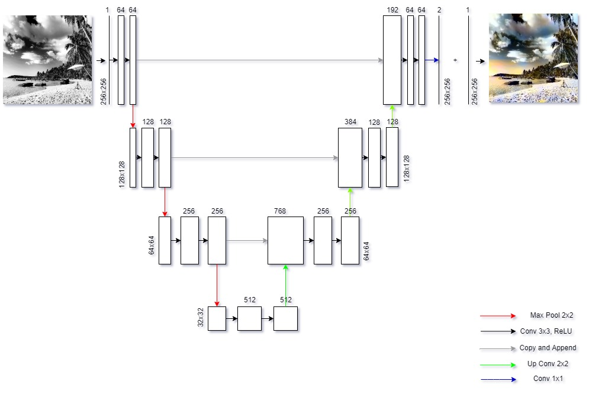

# UNet-Colorization
Implementation of Colorization using U-Net architecture and further experiments by modifying the model with different U-Net architectures with different number of down-sampling and up-sampling operations.

# Architecture
<h3 align="center">
  
</h3>

# References
https://arxiv.org/abs/1505.04597
